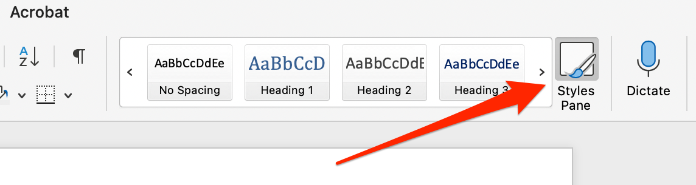
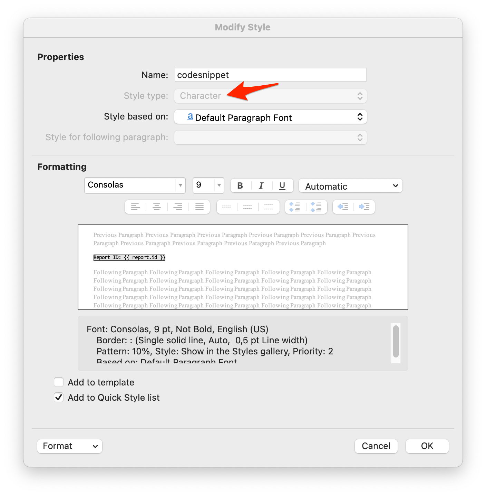
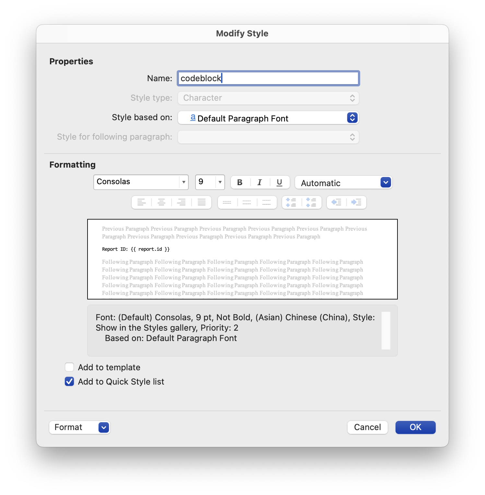
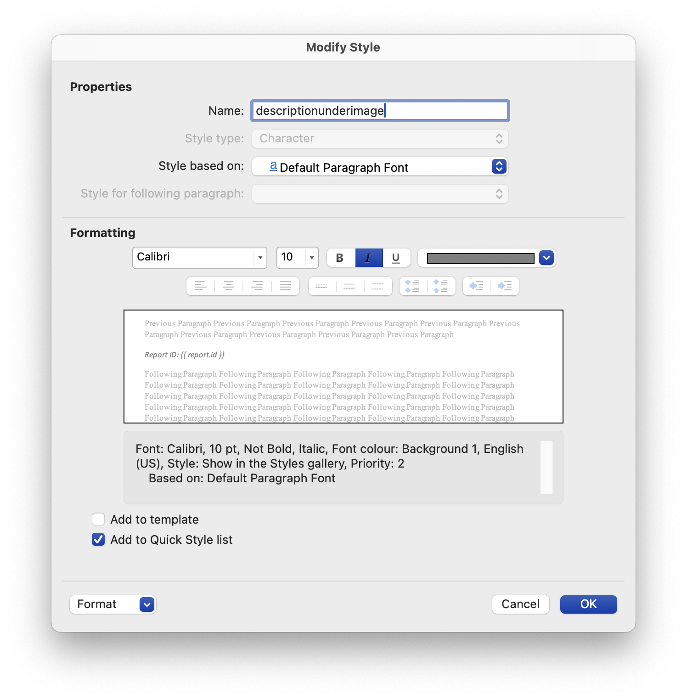

## 🔎 Application Views
The application consists of the following views:

- **Home** - This is the landing page of the application, providing an overview and quick access to key features and recent activities.
- **Reports** - This view allows users to create, manage, and view detailed reports. It includes options to customize report templates and generate reports based on predefined styles.
- **Vulnerabilities** - This view lists all identified vulnerabilities, providing detailed information such as severity, description, impact, and recommendations for remediation.
- **Templates** - This view enables users to manage and download report templates with predefined styles, ensuring consistency and proper formatting across reports.
- **Docs** - This view contains documentation and guidelines for using the application, including instructions for creating templates and utilizing various features effectively.

## 🎨 Report template creation
In order to create a report template, the user must create a DOCX file with the following styles defined (all in lowercase): `codesnippet` for inline code, `codeblock` for blocks of code, and `descriptionunderimage` for text descriptions placed under images. These styles ensure proper formatting and consistency throughout the report. Sample report template with those styles created can be downloaded from "Templates".

To create style in Word go to `Home -> Styles Pane`

<div style="border: 2px solid lightgray; display: inline-block;">
    
</div>

There create the following three styles as (Character) style type:
### codesnippet


### codeblock


### descriptionunderimage


And thats it! Now you can add Jinja-style tags to your report right in the Microsoft Word and enjoy generated reports.

## 📋 Template tags
When generating report it is possible to use templates using: `report` and `vulnerabilities` objects.

- `report` - contains basic information about the report itself, such as metadata or summary details.
- `vulnerabilities` - is an array of `Vulnerability` objects, where each object holds data about specific issues or problems associated with the report.

⚠️⚠️⚠️
Tags using rich text formatting `{{r <tag> }}` will parse markdown syntax and apply Word styling to match the formatting used in Markdown. This ensures that elements such as bold, italics, lists, and links are rendered in the generated report with the same appearance as they would in a Markdown document.

These objects can be utilized to dynamically generate or process report-related data. The following attributes can be used within the tags:

### report 
The following `report` attributes can be used:

- `{{ report.id }}` - numeric id of the report  
- `{{ report.title }}` - title of the report  
- `{{ report.client }}` - report client field  
- `{{ report.authors }}` - string of all report authors  
- `{{ report.start_date }}` - date in ISO 8601 format (YYYY-MM-DD)  
- `{{ report.end_date }}` - date in ISO 8601 format (YYYY-MM-DD)  
- `{{ report.retest_date }}` - date in ISO 8601 format (YYYY-MM-DD)  
- `{{r report.summary }}` - markdown parsed summary  
- `{{r report.scope }}` - markdown parsed scope  
- `{{ report.critical_issue_count }}` - numeric count of critical issues  
- `{{ report.high_issue_count }}` - numeric count of high issues  
- `{{ report.medium_issue_count }}` - numeric count of medium issues  
- `{{ report.low_issue_count }}` - numeric count of low issues  
- `{{ report.info_issue_count }}` - numeric count of informative issues  
- `{{ report.issue_chart }}` - image of a chart of all vulnerabilities by risk  


## vulnerabilities
To get access to each object into array we need to plase each `vulnerability` tag in a loop:
```

    Vulnerability ID: {{ vulnerability.id }}

```

The following `vulnerability` attributes can be used:

- `{{ vulnerability.id }}` - numeric id  
- `{{ vulnerability.color }}` - hex color without '#'  
- `{{r vulnerability.title }}` - title with richtext format coloring  
- `{{ vulnerability.title_plain }}` - title without richtext format  
- `{{r vulnerability.severity }}` - issue severity (Critical, High, Medium, Low, Info) in square brackets '[]' and colored  
- `{{ vulnerability.severity_plain }}` - title without formatting  
- `{{r vulnerability.description }}` - markdown parsed description of the vulnerability  
- `{{ vulnerability.score }}` - CVSS 3.0 score  
- `{{ vulnerability.cvss }}` - CVSS 3.0 vector  
- `{{r vulnerability.impact }}` - markdown parsed impact of the vulnerability  
- `{{r vulnerability.poc }}` - markdown parsed technical details  
- `{{r vulnerability.recommendation }}` - markdown parsed recommendation of the vulnerability  

## 🪄 Examples
Below please find some examples of using templates in report template.

### Select only top three vulnerabilities
```


Vulnerability title: {{ vulnerability.title_plain }} 


```

### Dynamically update vulnerability count in report
```
During the test {{ report.high_issue_count }} high vulnerabilities were found.
```

### Generate vulnerability chart
```
{{ report.issue_chart }}
```

### Fill cell to color with severity
```
 
```

Download a [template](/templates/default) from "Templates" view for more examples!