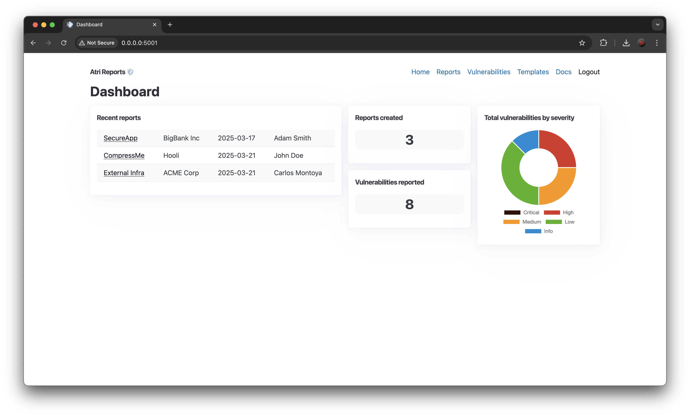

# Atri Reports 💨
Writing a pentest report with DOCX templates has never been easier! Atri Reports makes pentest reporting process fast and easy so you can focus on finding more awesome vulnerabilities.



**Atri** (a short form of *Attribute*) **Reports** is a tool written in Python using [FastHTML](https://fastht.ml/) framework that make security assessment report writing faster. It uses [docxtpl](https://docxtpl.readthedocs.io/en/latest/) library which allows report generation using simple Jinja-like template handles. Application uses HTTP by default, use reverse proxy to expose the application using SSL.

▶️ If you want a quick overview of the app can check out the [demo](https://vimeo.com/1070240043/fd4183d5ec).

🧑‍🎓 If you want to see a tutorial how to create a template from an [example](https://github.com/hmaverickadams/TCM-Security-Sample-Pentest-Report/blob/master/Demo%20Company%20-%20Security%20Assessment%20Findings%20Report.docx) pentest report see the [tutorial](https://vimeo.com/1070240213/001810725f).

For more insight visit [documentation](./DOCS.md) page.

## Installation 🛠️
The easiest and most secure way to run Atri Reports is with [Docker](https://www.docker.com/).

### Prerequisites

Ensure you have the following installed:

- [Docker](https://www.docker.com/)
- Optional: [Docker Compose](https://docs.docker.com/compose/)


### 1. Clone the repository
```bash
git clone https://github.com/redfr0g/atri
cd atri
```

### 2. Build the Docker Image
```bash
docker build -t atri-reports .
```

For specific architecture use this command:

```bash
docker buildx build --platform linux/amd64 -t atri-reports .
```

If you want a custom naming convention replace `atri-reports` with a name for the Docker image.

### 3. Run Docker Container
To start a container from the built image on port 80, use the following command:

```bash
docker run -it -p 80:5001 atri-reports
```

### 4. Log in to application
To log in to the application visit the following URL:

- http://localhost/login

Default user is "atri" and password for first login will be generated and displayed to the console.